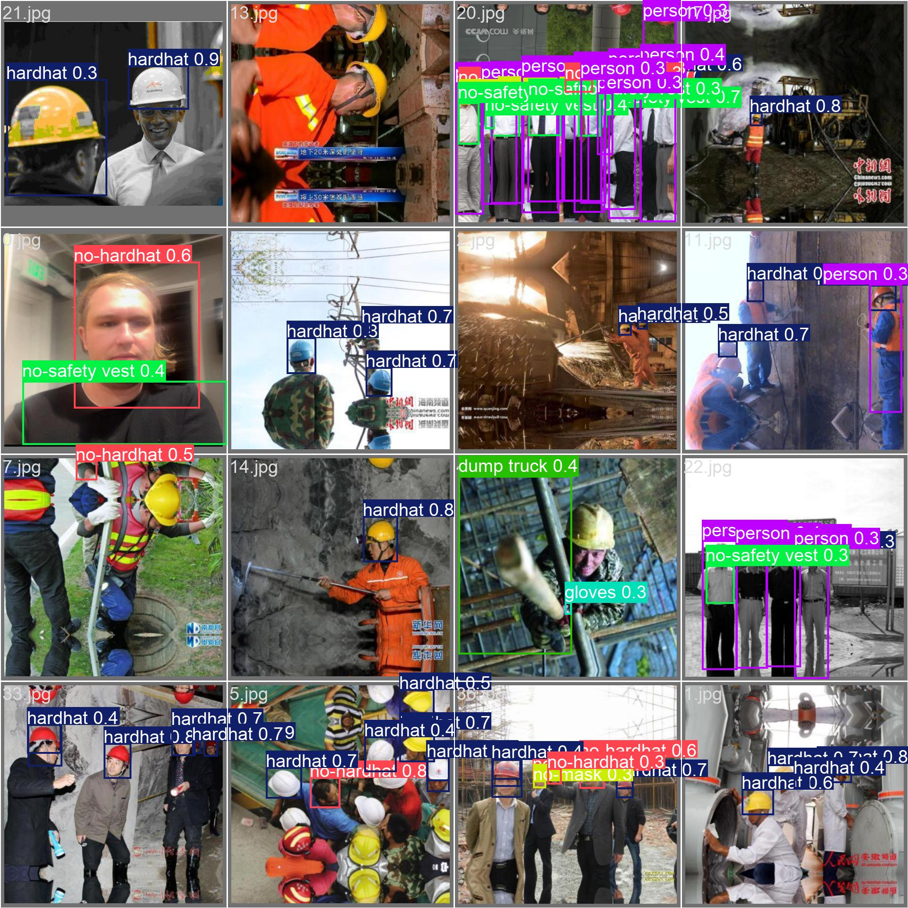
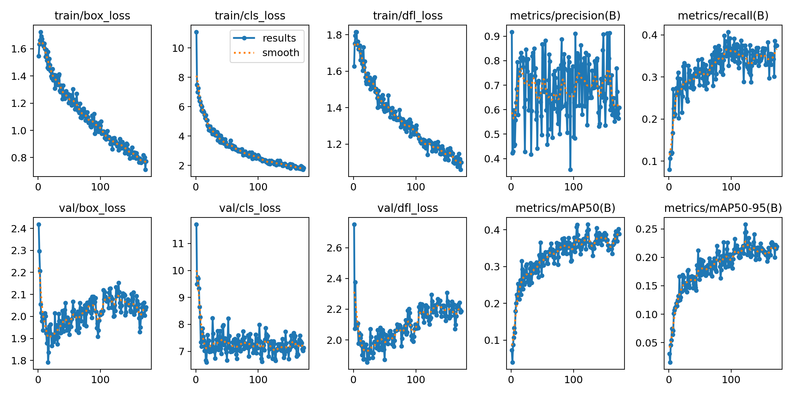

# Construction Safety and Machinery Detection System based on YOLOv11-Ghost

# 基于 YOLOv11-Ghost 的建筑工地安全防护与机械检测系统



This project is the final assignment for the Computer Vision course at Macau University of Science and Technology (MUST). We implement a lightweight detection system to identify 17 classes of construction safety elements using the YOLOv11-Ghost architecture.

## 1. Requirements: Software (环境配置)

- **Python**: 3.12+
    
- **Operating System**: Windows 11 / Linux (Ubuntu 22.04+)
    
- **GPU**: NVIDIA GeForce RTX 4060 Laptop GPU (Tested)
    
- **Framework**: PyTorch >= 2.5.1
    
- **Main Library**: Ultralytics 8.3.58
    

### Installation (安装)

```
git clone [https://github.com/](https://github.com/)[Your-GitHub-Username]/Construction_Safety_Project.git
cd Construction_Safety_Project
pip install -r requirements.txt
```

## 2. Pretrained Models (预训练模型)

After 14 rounds of ablation studies, we selected the **V2 Balanced** version as our final model.

- **Architecture**: YOLOv11n-Ghost-Nano
    
- **Best Weight**: `weights/best.pt`
    
- **mAP50**: 41.4%
    
- **Inference Latency**: 4.3ms (GPU)
    
- **Highlights**: Exceptional accuracy for **Excavators (99.5%)**, **Loaders (94.3%)**, and **Hardhats (53.3%)**.
    

## 3. Preparation for Testing (测试运行命令)

Ensure `best.pt` is in the `weights/` folder.

### Image Detection (图片检测)

```
python src/detect.py --weights weights/best.pt --source data/test_images/ --imgsz 1024
```

### Video Detection (视频检测)

```
python src/detect.py --weights weights/best.pt --source data/demo_video.mp4 --imgsz 1024
```



## 4. Team Members & Contributions (团队分工)

- **Qi Letian (1220013185)**: Lead of model training, hyperparameter optimization, performance analysis, and GitHub repository management.
    
- **Zen Wenchu (1220005808)**: Lead of results analysis, comparative analysis between experimental versions, and final project report writing.
    

**© 2025 Computer Vision Project Team - MUST**
